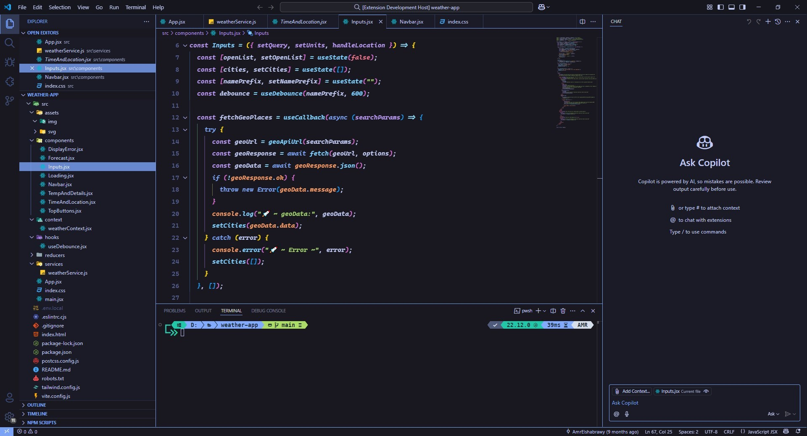
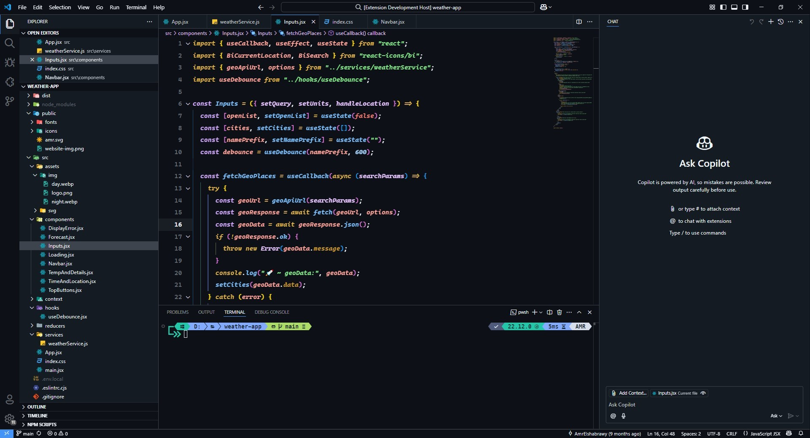

# 🎨 Rich Black Theme for VS Code

Transform your coding environment with this meticulously crafted dark theme collection for Visual Studio Code. Featuring:

- 🖤 True black background perfectly optimized for OLED/AMOLED displays
- 🎨 Intelligent syntax highlighting with semantic color mapping
- 🌈 Scientific color theory-based palette for maximum readability
- 🔷 Distinctive accent colors that pop without strain
- ✨ Modern, clutter-free interface design
- 💻 Performance optimized for marathon coding sessions
- 🎯 Enhanced contrast for better code comprehension
- 🌙 Multiple variants for different lighting conditions

Perfect for developers who demand both aesthetics and functionality in their coding environment. Available in six carefully crafted variants:

- 🖤 **Rich Black** - Pure OLED-optimized dark theme with perfect contrast and vibrant accents for crystal-clear code visibility
- 🦉 **Rich Night Owl** - Gentle dark blue tones specially designed for reduced eye strain during late-night coding sessions
- 🌊 **Rich Blue** - Professional navy-based dark theme with enhanced readability and color semantics for focused daytime development
- 🐱 **Rich Github** - Modern dark interpretation of GitHub's familiar color palette with improved contrast and visual hierarchy
- ✨ **Rich Golden** - Luxurious dark theme featuring warm golden accents and amber undertones for a sophisticated coding experience
- 🌌 **Rich Cosmic Night** - Celestial-inspired dark theme with subtle brown undertones and stellar highlights for an immersive atmosphere

<details>
<summary>🖤 <strong>Rich Dark Preview</strong></summary>

</details>

<details>
<summary>🦉 <strong>Night Owl Preview</strong></summary>

</details>

<details>
<summary>🌊 <strong>Rich Blue Preview</strong></summary>

</details>

<details>
<summary>🐱 <strong>Rich Github Preview</strong></summary>

</details>

---

## 📦 Installation

### 1️⃣ Via VS Code Marketplace (Recommended)

1. Launch **Visual Studio Code**
2. Access the **Extensions view**:
   - Click the **Extensions icon** in the sidebar
   - Use keyboard shortcut:
     - Windows/Linux: `Ctrl + Shift + X`
     - macOS: `Cmd + Shift + X`
3. In the search box, type **"Amr Rich Black Theme"**
4. Locate the theme in the results and click **Install**
5. Once installed, click **Reload** to activate
6. Select the theme:
   - Press `Ctrl/Cmd + K + T`
   - Choose "Rich Black" from the list
7. 🌟 If you enjoy the theme, please consider rating it!

### 2️⃣ Via Quick Open

1. Launch VS Code
2. Press `Ctrl/Cmd + P`
3. Paste: `ext install amr-rich-black-theme`
4. Press Enter

### 3️⃣ Manual Installation

You can also install the extension directly using the terminal:

```bash
code --install-extension amr-rich-black-theme
```

---

## Issues & Suggestions

For any issues or suggestions, please use [GitHub issues](https://github.com/Amr-Elshabrawy-Dev/rich-black-theme/issues).

---

## 🔍 Features

### 📱 Display Optimization

- 🖤 OLED/AMOLED Optimized: True black (#000000) background for perfect contrast
- 🌙 Low-Light Mode: Carefully calibrated colors for night-time coding
- 👀 Eye Care: Reduced blue light emission and optimal contrast ratios

### 🎨 Syntax Enhancement

- 🎯 Semantic Token Support: Advanced language-aware highlighting
- 🔍 Context-Aware Colors: Different hues for variables, functions, and types
- 📝 Rich Typography: Optional italics for comments, keywords, and decorators
- 🎭 Bracket Pair Colorization: Enhanced nested code readability

### 💻 Editor Integration

- ⚡ Performance Optimized: Minimal GPU usage and instant rendering
- 🔄 Git Integration: Distinctive colors for added, modified, and deleted content
- 💠 Minimap Enhancement: Clear code structure visualization
- 📊 Indent Guidelines: Subtle but clear indentation markers

### 🛠 Development Features

- 🔍 Debug Highlighting: Clear indication of breakpoints and current execution
- ⚠️ Error Visualization: Distinct colors for errors, warnings, and info
- 📱 Panel Integration: Themed terminal, output, and debug console
- 🎯 Peek View: Enhanced inline code reference viewing

### 🎛 Workbench Features

- 🎨 Custom UI Elements: Themed scrollbars, buttons, and panels
- 📑 Tab Management: Clear active/inactive tab distinction
- 💫 Status Bar: Information-rich bottom bar with clear indicators
- 🔲 Panel Borders: Subtle separation between UI elements

---

## 🛠️ How to Use

- Open Command Palette (Ctrl + Shift + P or Cmd + Shift + P).
- Type Preferences: Color Theme.
- Search for "Rich Dark Theme" and select it.

Alternatively, you can modify your `settings.json`:

```json
{
  "workbench.colorTheme": "Rich Github"
}
```

---

## ⚙️ Recommended Settings

For the best experience with Rich Black Theme, we recommend the following configurations in your VS Code `settings.json`:

### 📝 Basic Settings

- Optimized font configuration
- Enhanced readability settings
- Improved visual appearance
- Customized cursor behavior

### 🎨 Theme Customization

You can further personalize your setup by adding these settings:

```json
{
  "window.zoomLevel": -0.25,
  "editor.fontFamily": "Cascadia Code, VictorMono Nerd Font, Fira Code",
  "editor.fontSize": 16,
  "editor.lineHeight": 30,
  "editor.fontWeight": "bold",
  "terminal.integrated.fontWeight": "bold",
  "terminal.integrated.fontFamily": "MesloLGS NF",
  "editor.fontLigatures": "'ss02', 'ss03', 'ss19', 'ss20'",
  "editor.showFoldingControls": "always",
  "workbench.colorTheme": "Rich Black Theme",
  "workbench.editor.pinnedTabSizing": "compact",
  "editor.wordWrap": "bounded",
  "editor.wordWrapColumn": 100,
  "editor.renderLineHighlight": "gutter",
  "indentRainbow.indicatorStyle": "light",
  "indentRainbow.colors": [
    "rgba(49, 142, 204,0.3)",
    "rgba(127,255,127,0.3)",
    "rgba(255,127,255,0.3)",
    "rgba(255,255,64,0.3)"
  ],
  "workbench.iconTheme": "material-icon-theme",
  "workbench.productIconTheme": "fluent-icons",
  "editor.cursorBlinking": "expand",
  "editor.cursorSmoothCaretAnimation": "on",
  "editor.cursorWidth": 4
}
```

---

## 📖 Contributing

We welcome contributions to make this theme even better! Here's how you can help:

### 🚀 Getting Started

1. Fork the repository
2. Clone your fork: `git clone https://github.com/YOUR-USERNAME/rich-black-theme.git`
3. Create a feature branch: `git checkout -b feature/your-feature-name`
4. Install dependencies: `npm install`

### 💻 Development

1. Make your changes to the theme files in the `themes` directory
2. Test your changes:
   - Press F5 to open a new VS Code window with your changes
   - Use `npm run test` to run theme tests
3. Update documentation if needed

### 📝 Submission Guidelines

1. Ensure your code follows our style guidelines
2. Add comments for any complex color choices
3. Test your theme in different file types
4. Commit your changes: `git commit -m "feat: add new feature"`
5. Push to your fork: `git push origin feature/your-feature-name`
6. Open a Pull Request with:
   - Clear description of changes
   - Screenshots if applicable
   - Any related issues

### 🔍 What We're Looking For

- Bug fixes
- Color scheme improvements
- New theme variants
- Documentation enhancements
- Accessibility improvements

For major changes, please open an issue first to discuss your ideas.

---

## 📜 License

- This extension is licensed under the MIT License.

---

## 🙌 Acknowledgments

- Thank you to the open-source community that continuously improves the tools we use every day.
- This extension relies on standard VS Code UI and built-in themes but aims to offer a more cohesive black interface experience.

---

## 🌐 Support

<div align="center">

[](https://github.com/Amr-Elshabrawy-Dev/rich-black-theme) [](https://marketplace.visualstudio.com/items?itemName=rich-black-theme.amr-rich-black-theme) [](https://marketplace.visualstudio.com/items?itemName=rich-black-theme.amr-rich-black-theme) [](https://marketplace.visualstudio.com/items?itemName=rich-black-theme.amr-rich-black-theme)

</div>

---

### 🤝 Get in Touch

<div align="center">

[](https://github.com/Amr-Elshabrawy-Dev) [](https://github.com/Amr-Elshabrawy-Dev) [](https://www.linkedin.com/in/amr-elshabrawy-dev) [](mailto:amrelshabrawy.dev@gmail.com) [](https://wa.me/201202546653) [](https://www.x.com/@AmrElshabr43803)

</div>

---

  <div align="center">
    <h1 style="color: #2ea44f;">👨‍💻 AMR ELSHABRAWY</h1>
      
      <p style="color: #586069;">
        Created with 💚 by <strong><a href="https://github.com/Amr-Elshabrawy-Dev">AMR ELSHABRAWY</a></strong> 🌟 &copy; 2025
      </p>
  </div>

---
