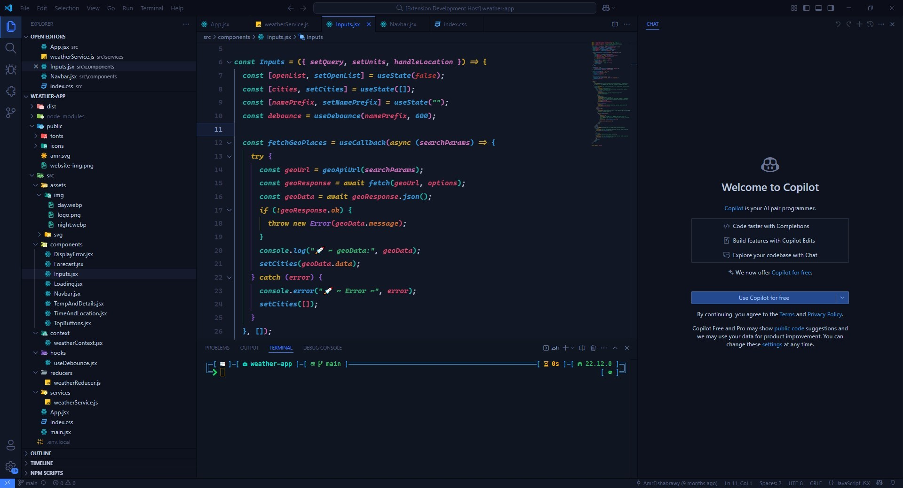
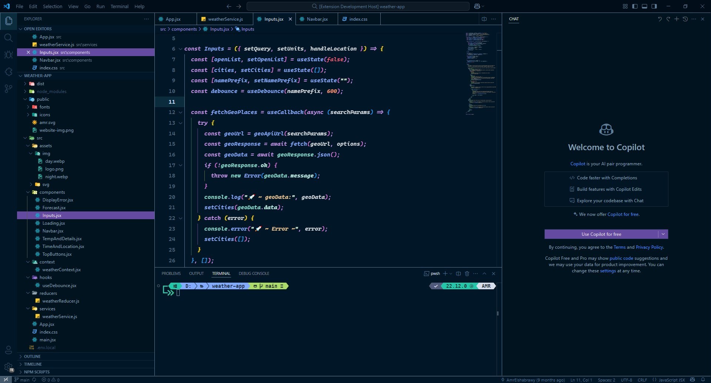
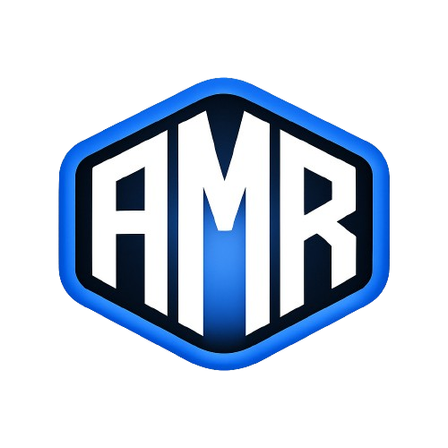

# 🎨 Rich Dark Theme for VS Code

A sophisticated **dark theme** for Visual Studio Code that delivers an unparalleled coding experience. Featuring:

- 🖤 Pure black background optimized for OLED displays
- 🎨 Vibrant syntax highlighting for enhanced code readability
- 🌈 Carefully curated color palette for reduced eye strain
- ✨ Modern and elegant interface design
- 💻 Optimized for long coding sessions

Perfect for developers who demand both style and functionality in their coding environment. Available in two variants: **Rich Black** and **Night Owl**.

<details>
<summary><strong>Rich Black Preview</strong></summary>

</details>

<details>
<summary><strong>Night Owl Preview</strong></summary>

</details>

<details>
<summary><strong>Rich Dark Preview</strong></summary>

</details>

---

## 📦 Installation

### Via VS Code Marketplace

- Open **Visual Studio Code**.
- Go to the **Extensions view** by clicking the **Extensions icon** in the sidebar or pressing `Ctrl + Shift + X`.
- Search for **"Amr Rich Black Theme"**.
- Click **Install** to add the theme to your VS Code.
- 🌟🌟🌟🌟🌟 Rate five-stars 😃

---

### Via Command Line

You can also install the extension directly using the terminal:

```bash
code --install-extension your-publisher-name.rich-black-theme
```

---

## Issues & Suggestions

For any issues or suggestions, please use [GitHub issues](https://github.com/Amr-Elshabrawy-Dev/rich-black-theme/issues).

---

## 🔍 Features

**🎨 Rich Black Theme:**

- 🖤 Sleek Black Interface: Ultra-dark theme optimized for long coding sessions
- 🌈 Rich Syntax Highlighting: Vibrant colors that pop against the deep black background
- 👀 High Contrast: Carefully selected color combinations for optimal readability
- ⚙️ Customizable UI: Fine-tuned controls for personalizing your coding environment
- 💻 Code-First Design: Optimized for multiple programming languages and frameworks

**🌙 Night Owl Theme:**

- 🌌 Soft Dark Interface: Comfortable dark blue tones for reduced eye strain
- 🎨 Natural Syntax Colors: Nature-inspired color palette for intuitive coding
- 🔍 Semantic Highlighting: Enhanced code readability with meaningful color associations
- 🌙 Low-Light Optimized: Perfect for late-night coding sessions
- ♿ Accessible Design: Carefully chosen contrast ratios for better visibility

**🌑 Rich Dark Theme:**

- 🎭 Modern Dark Interface: Balanced dark theme for professional coding
- 🎨 Refined Color Scheme: Elegant palette with moderate contrast levels
- 🔆 Clear Visibility: Enhanced readability in various lighting conditions
- 🛠️ Multi-Language Support: Optimized for diverse programming languages
- 🖥️ Professional Design: Clean and distraction-free coding environment

**✨ Both themes feature:**

- 🎯 Custom Workbench Colors: Harmonious UI elements across the entire IDE
- 📝 Italic Support: Enhanced styling for comments and keywords
- 🔄 Git Decoration: Clear indication of source control changes
- 💻 Integrated Terminal: Matching colors for a consistent experience

---

## 🛠️ How to Use

- Open Command Palette (Ctrl + Shift + P or Cmd + Shift + P).
- Type Preferences: Color Theme.
- Search for "Rich Black Theme" and select it.

Alternatively, you can modify your `settings.json`:

```json
{
  "workbench.colorTheme": "Rich Black Theme"
}
```

---

## ⚙️ Recommended Settings

For the best experience with Rich Black Theme, we recommend the following configurations in your VS Code `settings.json`:

### 📝 Basic Settings

- Optimized font configuration
- Enhanced readability settings
- Improved visual appearance
- Customized cursor behavior

### 🎨 Theme Customization

You can further personalize your setup by adding these settings:

```json
{
  "window.zoomLevel": -0.25,
  "editor.fontFamily": "Cascadia Code, VictorMono Nerd Font, Fira Code",
  "editor.fontSize": 16,
  "editor.lineHeight": 30,
  "editor.fontWeight": "bold",
  "terminal.integrated.fontWeight": "bold",
  "terminal.integrated.fontFamily": "MesloLGS NF",
  "editor.fontLigatures": "'ss02', 'ss03', 'ss19', 'ss20'",
  "editor.showFoldingControls": "always",
  "workbench.colorTheme": "Rich Black Theme",
  "workbench.editor.pinnedTabSizing": "compact",
  "editor.wordWrap": "bounded",
  "editor.wordWrapColumn": 100,
  "editor.renderLineHighlight": "gutter",
  "indentRainbow.indicatorStyle": "light",
  "indentRainbow.colors": [
    "rgba(49, 142, 204,0.3)",
    "rgba(127,255,127,0.3)",
    "rgba(255,127,255,0.3)",
    "rgba(255,255,64,0.3)"
  ],
  "workbench.iconTheme": "material-icon-theme",
  "workbench.productIconTheme": "fluent-icons",
  "editor.cursorBlinking": "expand",
  "editor.cursorSmoothCaretAnimation": "on",
  "editor.cursorWidth": 4
}
```

---

## 📖 Contributing

If you'd like to contribute to improving the theme or add new features:

- Fork this repository.
- Create a new branch for your feature or bugfix.
- Make your changes and run tests locally.
- Open a Pull Request with a clear description of what you've done.

---

## 📜 License

- This extension is licensed under the MIT License.

---

## 🙌 Acknowledgments

- Thank you to the open-source community that continuously improves the tools we use every day.
- This extension relies on standard VS Code UI and built-in themes but aims to offer a more cohesive black interface experience.

---

## 🌐 Support

<div align="center">

[](https://github.com/Amr-Elshabrawy-Dev/rich-black-theme) [](https://marketplace.visualstudio.com/items?itemName=rich-black-theme.amr-rich-black-theme) [](https://marketplace.visualstudio.com/items?itemName=rich-black-theme.amr-rich-black-theme) [](https://marketplace.visualstudio.com/items?itemName=rich-black-theme.amr-rich-black-theme)

</div>

---

### 🤝 Get in Touch

<div align="center">

[](https://github.com/Amr-Elshabrawy-Dev) [](https://github.com/Amr-Elshabrawy-Dev) [](https://www.linkedin.com/in/amr-elshabrawy-dev) [](mailto:amrelshabrawy.dev@gmail.com) [](https://wa.me/201202546653) [](https://www.x.com/@AmrElshabr43803)

</div>

---

  <div align="center">
    <h1 style="color: #2ea44f;">👨‍💻 AMR ELSHABRAWY</h1>
      
      <p style="color: #586069;">
        Created with 💚 by <strong><a href="https://github.com/Amr-Elshabrawy-Dev">AMR ELSHABRAWY</a></strong> 🌟 &copy; 2025
      </p>
  </div>

---