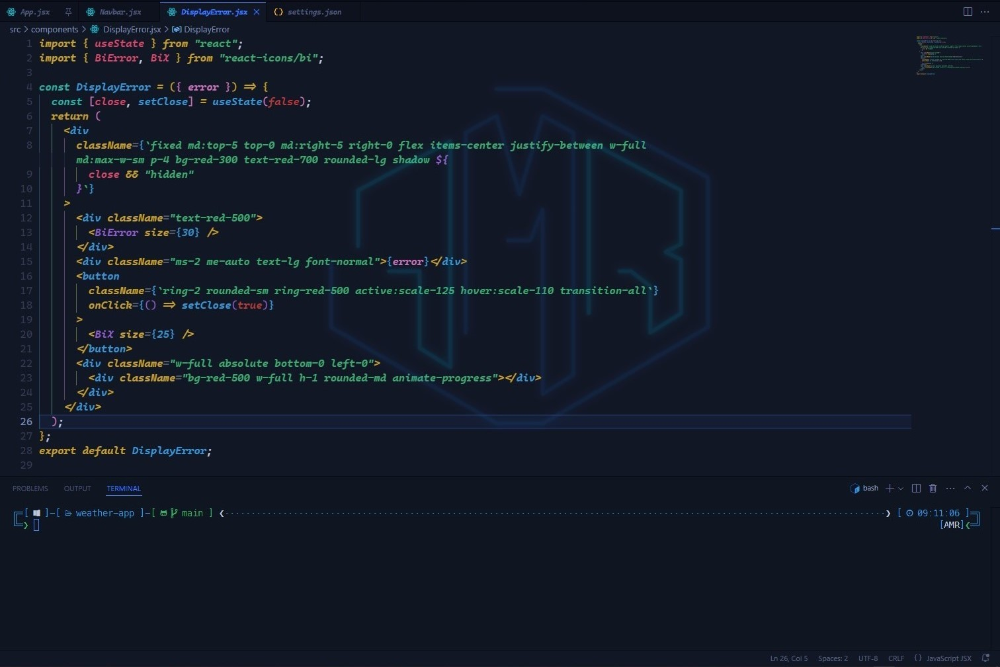
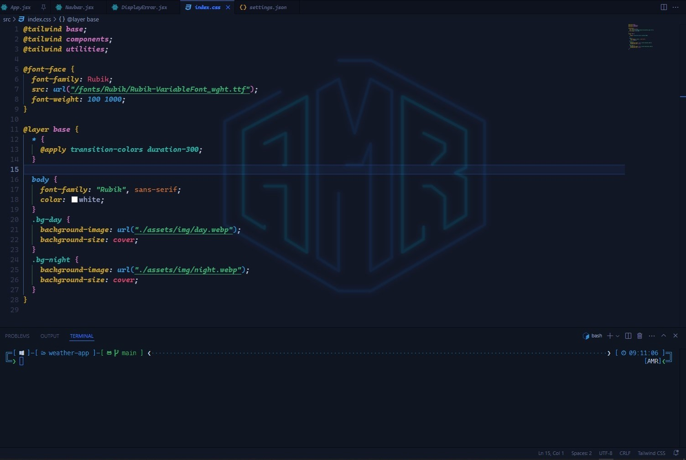
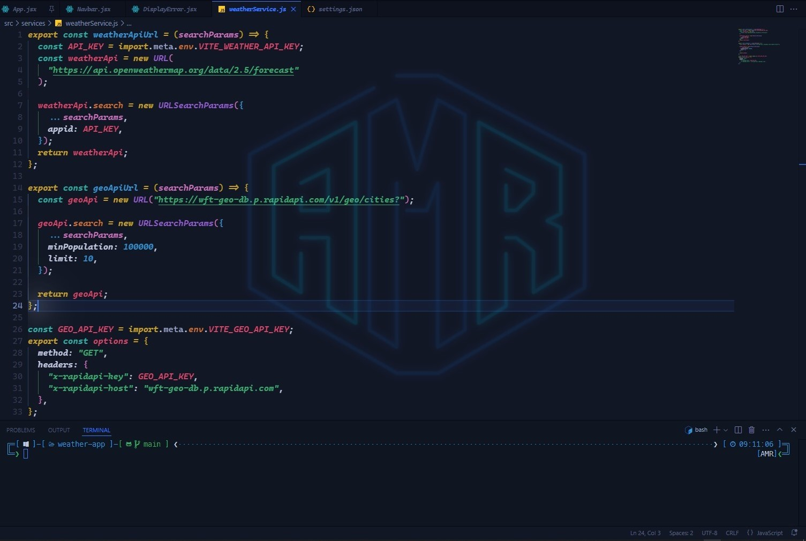
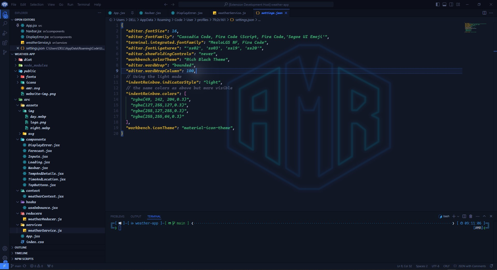
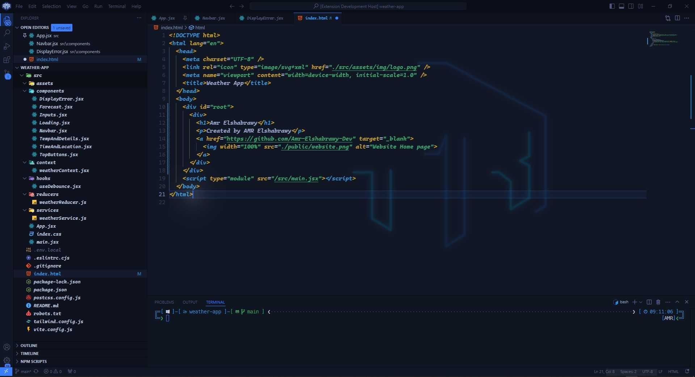

# 🎨 Rich Black Theme for VS Code

**react**

**css**

**javascript**

**json**

**html**


A rich and sleek **black color theme** for Visual Studio Code. This theme brings a modern and elegant black interface with a rich visual experience, perfect for developers who love a clean and dark workspace.

---

## 📦 Installation

### Via VS Code Marketplace

- Open **Visual Studio Code**.
- Go to the **Extensions view** by clicking the **Extensions icon** in the sidebar or pressing `Ctrl + Shift + X`.
- Search for **"Amr Rich Black Theme"**.
- Click **Install** to add the theme to your VS Code.
- 🌟🌟🌟🌟🌟 Rate five-stars 😃

---

### Via Command Line

You can also install the extension directly using the terminal:

```bash
code --install-extension your-publisher-name.rich-black-theme
```

---

## Issues & Suggestions

For any issues or suggestions, please use [GitHub issues](https://github.com/Amr-Elshabrawy-Dev/rich-black-theme/issues).

---

## 🔍 Features

- Sleek Black Interface: A visually appealing black theme with a smooth interface.
- Rich Syntax Highlighting: Enhanced syntax highlighting for multiple programming languages.
- Customizable Colors: Consistent and rich UI colors for a better coding experience.

---

## 🛠️ How to Use

- Open Command Palette (Ctrl + Shift + P or Cmd + Shift + P).
- Type Preferences: Color Theme.
- Search for "Rich Black Theme" and select it.

Alternatively, you can modify your `settings.json`:

```json
{
  "workbench.colorTheme": "Rich Black Theme"
}
```

---

## 📝 Configuration

You can customize some UI elements by modifying your `settings.json`. For example:

Activity Bar
To change the `activityBar` colors, modify:

```json
{
  "activityBar.activeBorder": "#3A7FFF",
  "activityBar.background": "#000000",
  "activityBar.activeForeground": "#FFFFFF",
  "editor.fontSize": 16,
  "editor.fontFamily": "Cascadia Code, Fira Code iScript, Fira Code",
  "terminal.integrated.fontFamily": "MesloLGS NF, Fira Code",
  "editor.fontLigatures": "'ss02', 'ss03', 'ss19', 'ss20'",
}
```

---

## 📖 Contributing

If you'd like to contribute to improving the theme or add new features:

- Fork this repository.
- Create a new branch for your feature or bugfix.
- Make your changes and run tests locally.
- Open a Pull Request with a clear description of what you've done.

---

## 📜 License

- This extension is licensed under the MIT License.

---

## 🙌 Acknowledgments

- Thank you to the open-source community that continuously improves the tools we use every day.
- This extension relies on standard VS Code UI and built-in themes but aims to offer a more cohesive black interface experience.

---

### 👋 Get In Touch

- [🌐 My Website 👉 https://github.com/Amr-Elshabrawy-Dev](https://github.com/Amr-Elshabrawy-Dev)
- [👔 LinkedIn 👉 https://www.linkedin.com/in/amr-elshabrawy-dev](https://www.linkedin.com/in/amr-elshabrawy-dev)
- [🌟 Github 👉 https://github.com/Amr-Elshabrawy-Dev](https://github.com/Amr-Elshabrawy-Dev)
- [📧 Gmail 👉 amrelshabrawy.dev@gmail.com](mailto:amrelshabrawy.dev@gmail.com)
- [🐤 Twitter 👉 https://twitter.com/AmrElshbrawy217](https://twitter.com/AmrElshbrawy217)
- [☎️ Whatsapp 👉 (+20) 120-254-6653](https://api.whatsapp.com/send/?phone=%2B2001202546653&text&type=phone_number&app_absent=0)

---

   <div style="width: 100%;" align="center">
     <h3 style="font-size: 30px;">AMR ElSHABRAWY</h3>
     
     <p> Created by &copy AMR Elshabrawy</p>
   </div>

---
